# **PayCalcs IE**

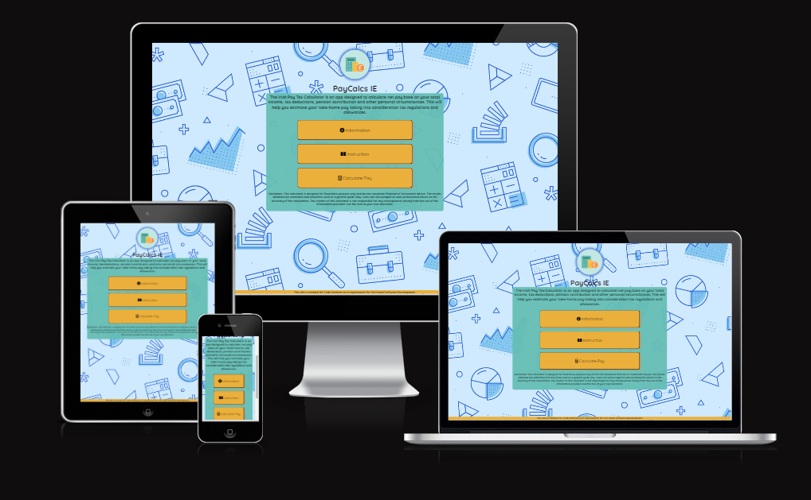

# Table of Contents

- [**Project Introduction**](#introduction)
    - [**PayCalcs IE**](#paycalcs-ie)
    - [**Link to live project**](#link-to-live-project)
    - [**Objective**](#objectives)
- [**Planning Stage**](#planning)
    - [**User Goals**](#user-goals)
    - [**Site Owner Goals**](#site-owner-goals)
- [**Design**](#design)
    - [**Wireframes**](#wireframes)
    - [**Colour Scheme**](#colour-scheme)
    - [**Fonts**](#fonts)
    - [**Imagery Used**](#imagery-used)
- [**Features**](#features)
- [**Technology Used**](#technology)
    - [**Language Used**](#language-used)
    - [**Frameworks, Libararies & Programs**](#)
- [**Testing**](#testing)
    - [**Code Validation**](#code-validation)
    - [**Contrast Grid**]()
    - [**Testing Performance**]()
    - [**Other Testing**]()
- [**Challenges**](#challenges)
- [**Future Enhancements**](#enhancements)
- [**Deployment**](#deployment)
- [**Acknowledgements**](#acknowledgement)
- [**Credits**](#credits)

    

## **Project Introduction**
### PayCalcs IE
Welcome to PayCalcs IE! This is a web based calculator designed to calculate net pay base on your total income, tax deductions, and other personal circumstances. This will help you estimate your take-home pay by taking into consideration tax regulations and allowances. Whether you are an individual planning your finances or a business owner managing your payroll, this calculator will help you simplify the process.

### [Link to live project](https://hpcoloma.github.io/project-portfolio-2/)
### Objectives
Ensure that users can quickly understand the purpose and functionality of the salary calculator.
Provide users with instruction on how to effectively use the salary calculator, making the process intuitive and user-friendly.
## **Planning Stage**
### User Goals
- Calculate take home pay - Users should be able to effortlessly input their salary details and receive accurate calculations for gross and net income.
- Consider Multiple Factors - The calculator should allow users to consider various factors such as tax rates, deductions, and bonuses, providing a comprehensive overview of their financial situation.
- Understand Results Clearly - The calculator should present results in a clear and understandable format, breaking down the details of gross income, net income, taxes paid, and deductions.
- Access a Consistent Interface - Users should experience a consistent interface with a title bar and site background that remains visible across all screens for easy navigation.

### Site Owner Goals
- To provide users a tool to calculate take home pay and give them an idea on how much tax they pay. Enhancing this calculator with additional target features in the future would benefit not just an individual users but also business owners.

## **Design**
### Wireframes
I used [Balsamiq](https://balsamiq.com) to generate digital sketches of how I want my site to look like on different devices. Balsamiq had helped me visualised my idea and finalised my design before I start writing my codes.

- **Home screen/Main Menu**

    

- **Information**

    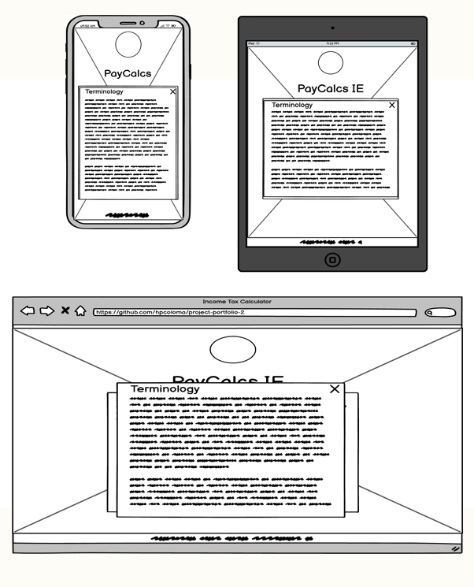

- **Instruction**

    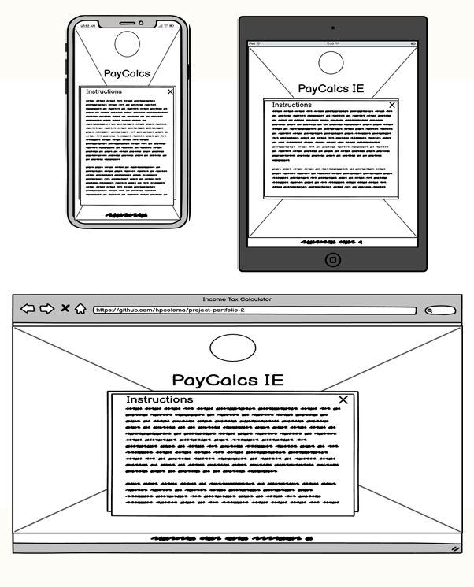

- **Calculate Pay**
    - *Basic and results*

        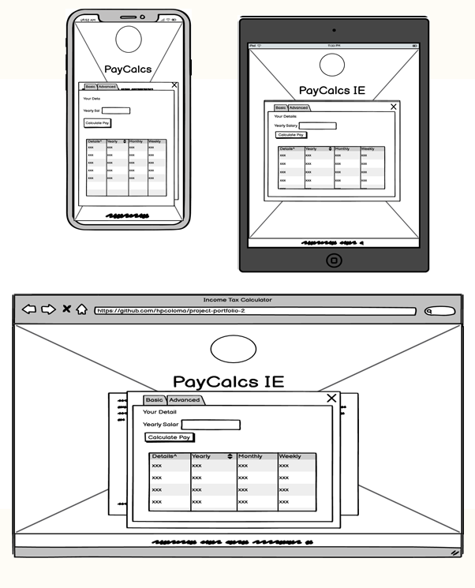

    
### Colour Scheme
I wanted a combination of earthy tones with vibrant pops of colors that creates a balanced palette. The color combination compliments each other, no color dominates or feels out of place. They harmonised and can be flexibly used in different design scenarios. I searched for a logo that would match my project idea. Logo that has a calculator and euro sign. I found this [LOGO IMAGE](https://cdn-icons-png.flaticon.com/128/9720/9720608.png) on the web for my logo. I changed the dollar sign to euro sign. I also found this [BACKGROUND IMAGE](https://cdn.stackoverflow.co/images/jo7n4k8s/production/81cf622ff38560139839d5be23fff951bd33a243-1420x920.png?rect=0,87,1420,746&w=1200&h=630&auto=format&dpr=2) and instantly liked the color combination. So I created a palette from these photos by uploading them to [Adobe Color](https://color.adobe.com) to get the hex codes for some of the color shades on the photos.

I also checked the colour combination contrast on 
[Eightshapes Grid Contrast](https://contrast-grid.eightshapes.com/) to ensure that text will be readable on the chosen background.

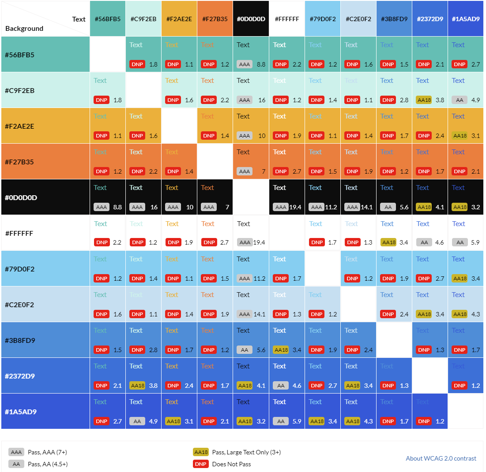

Link to the results [here](https://contrast-grid.eightshapes.com/?version=1.1.0&background-colors=&foreground-colors=%232A968B%0D%0A%234486DB%0D%0A%23C9F2EB%0D%0A%23F2AE2E%0D%0A%23FF8C36%0D%0A%23FFFFFF%0D%0A%230D0D0D&es-color-form__tile-size=compact&es-color-form__show-contrast=aaa&es-color-form__show-contrast=aa&es-color-form__show-contrast=aa18&es-color-form__show-contrast=dnp)

### Fonts
I wanted a plain sans serif text that is easy to read both on big and small screens. Also, that looks like a calculator texts. Quicksand is a display sans serif with rounded terminals. It's rounded letterforms give a soft and approachable feel, making it suitable for user interfaces. Quicksand maintains good readability, making it easy for users to view and understand salary-related information. The font's versatility allows it to adapt top various design styles while maintaining a cotemporary look. Font was downloaded from [Google Fonts](https://fonts.google.com/).

### Imagery Used
- I have very limited images used on this project. 

    The logo was sourced from [Flaticon](https://flaticon.com)

- The background was from [Stackoverflow](https://stackoverflow.com/).

 These images were reduced using [TinyPNG](https://tinypng.com).

Also, [Favicons](https://favicon.io/) for some icons used.

## **Features**
- The website incorporates a central column where JavaScript dynamically injects the pertinent HTML content. The title bar and site background persist across all screens

- Main Menu - on page loads, the main menu are displayed. Also, a description of the web app and a disclaimer.
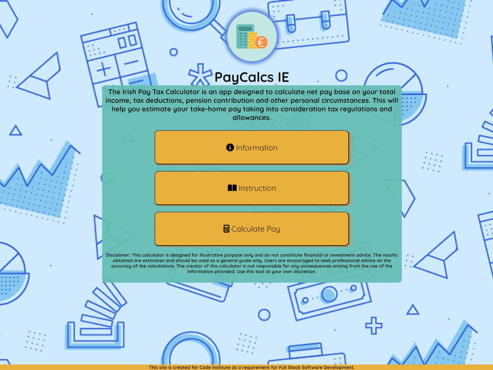

    - Information - list all terminologies that the user may come accross on processing pay.

    

    - Instruction - provides instruction on how to use Basic and Advance feature.
               
    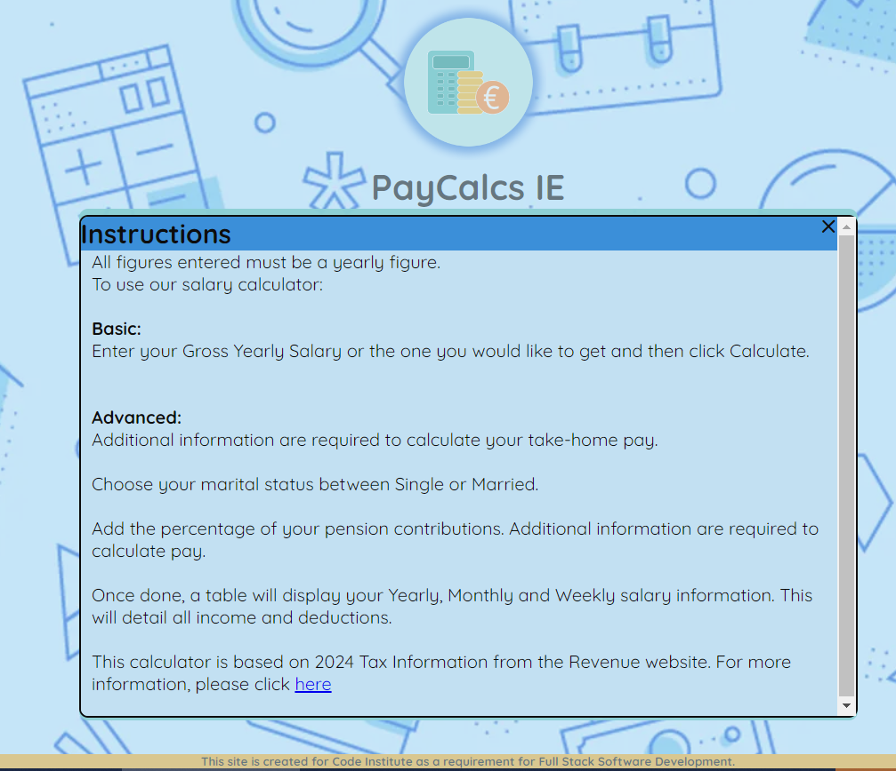

    - Calculate Pay - this provides the form to collect data entered by user to calculate pay. User can choose to do BASIC or ADVANCED calculcation.
    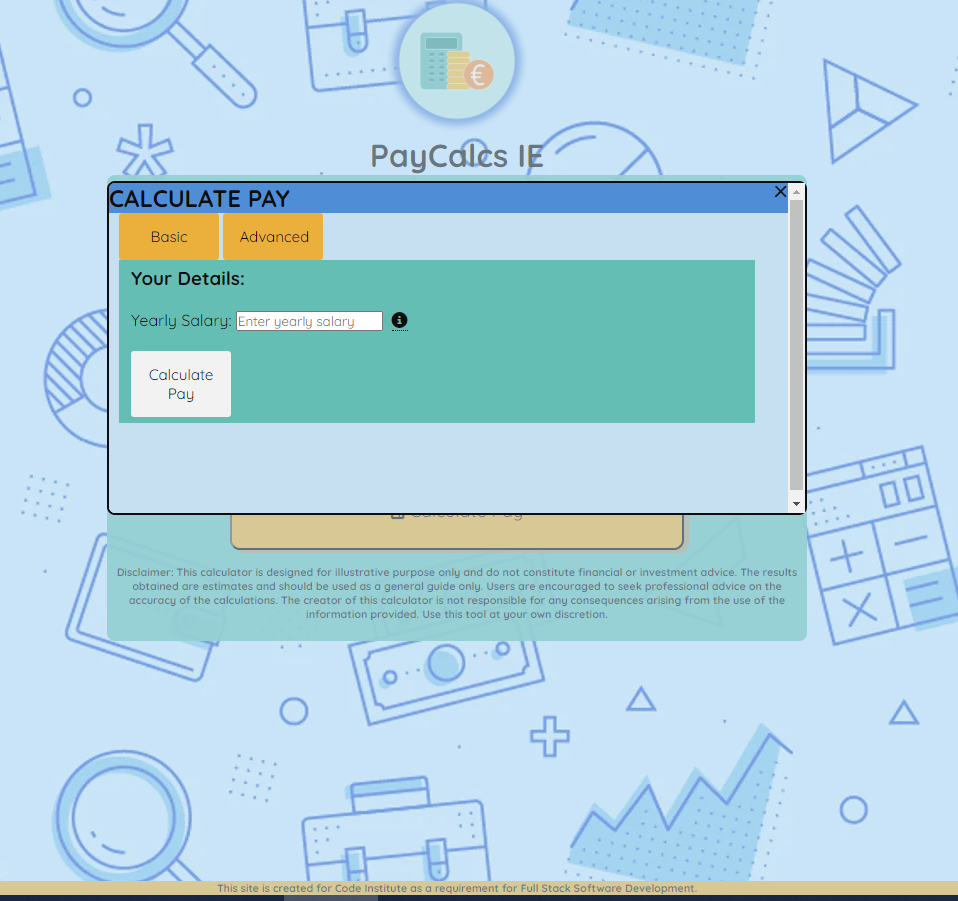

        - Basic - provides a standard calculation of take-home pay base on the salary entered, assuming that the user is a single person with no dependents and other income.
            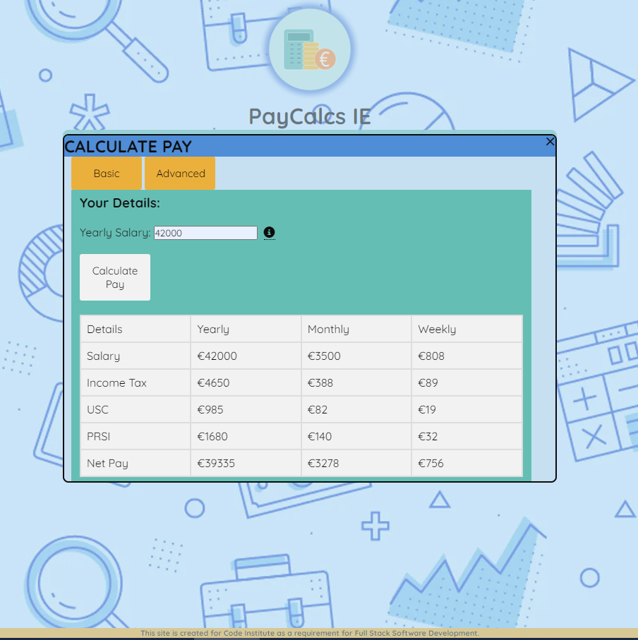

        - Advanced - calculates take-home pay base on salary, other income such as BIK and pension contribution. Factors such as dependents and status are considered. 
            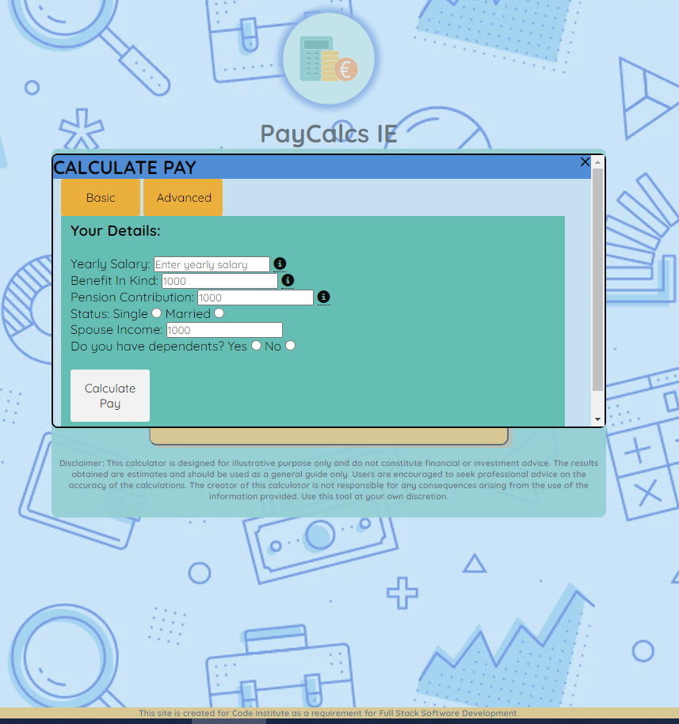

        - 404 page is also created fo the advanced section which is yet to be developed.
            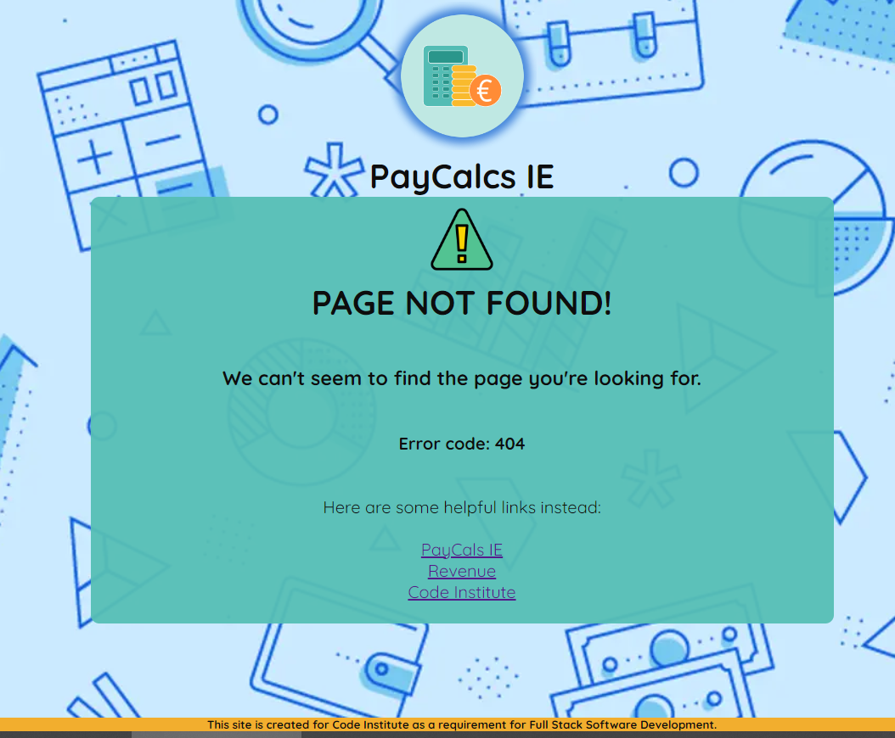
    - No Javascript Page is also set up if browser has javascript disabled.

## **Technology Used**
- **Language**
    - HTML
    - CSS3
    - Javascript
- **Frameworks, Libararies & Programs**
    - Photoshop to enhanced logo downlaoded from Flaticon.
    - [Balsamiq] for the wireframes
    - [Google Fonts](https://www.googlefonts.com) to import Quicksand to the stylesheet.
    - [GitHub](https://github.com/) for hosting project codes, maintaining repository.
    - [Gitpod](https://www.gitpod.io/d) used to work on my wokspace and build the app.
    - [Flaticon](https://www.flaticon.com) where I downlaoded the my logo.
    - [Fontawesome](https://fontawesome.com/icons) for menu icons.
    - [Favicon](https://favicon.io/) used to create favicons using logo from flaticon.
    - [Am I Responsive](https://amiresponsive.co.uk/) to show the image of the website on different device size.
    - [Visual Studio Online](https://visualstudio.microsoft.com/services/visual-studio-online/) - to work on github repositories.
    - ChatGPT for assistance on some description on this readme.

## **Testing**
**Code Validation**
- [W3C Validator](https://validator.w3.org/#validate_by_input) for HTML validation.
        -  Index. html validation
      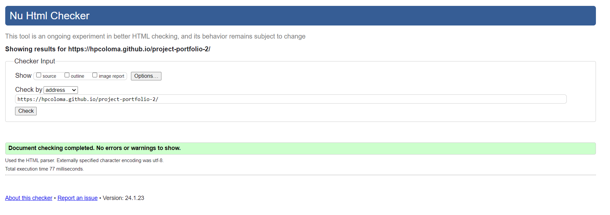
        - 404.html validation
        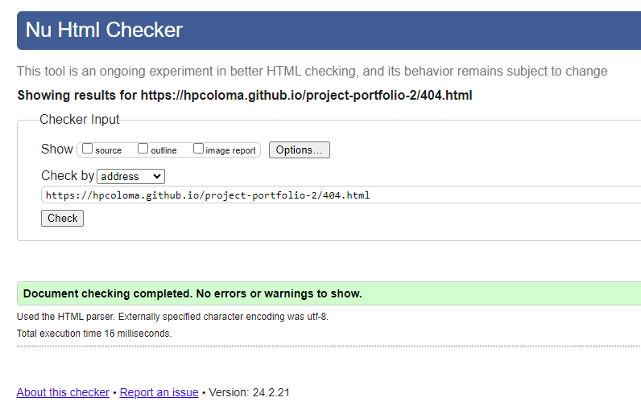

-  [W3C Validator](https://jigsaw.w3.org/css-validator/) for CSS validation.
        
       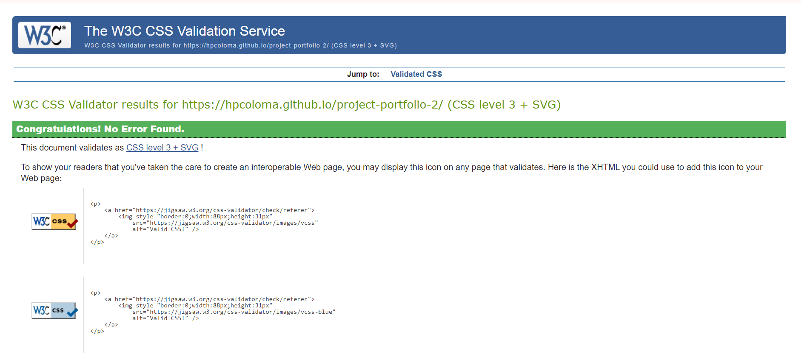
- [JSHint](assets/images/jshint.png) for Javascript code validation.
    
       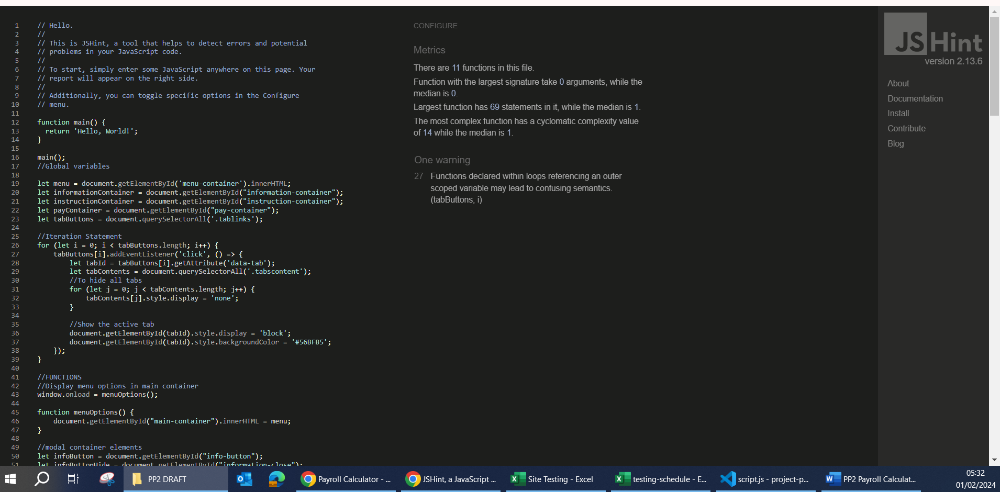
    
**Contrast Grid**
    - [Eightshapes Grid Contrast](https://contrast-grid.eightshapes.com/) for checking the colour contrast of my colour palette.  
**Testing Performance**
- Mobile    
       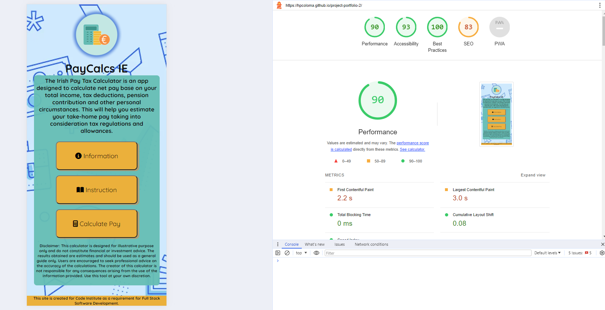 
- Desktop
       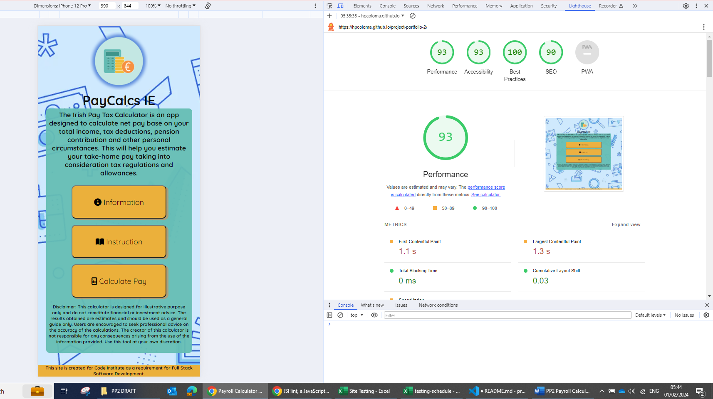
    
**Other Testing**
- Calculation Test - I compare results of my calculate pay to the result of this calculator online to check the accuracy of my calculator. [Link Here](https://salaryaftertax.com/ie/salary-calculator)
- No Javascript Page - display of noscript message by disabling JavaScript in browser options.

    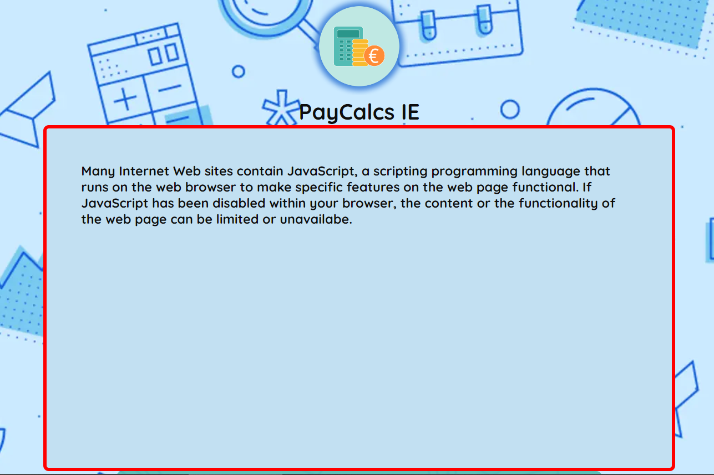

- Functionality Test - I validate each menu and links on the website with the help of a third party. User was able to navigate easily and can easily find functions.

     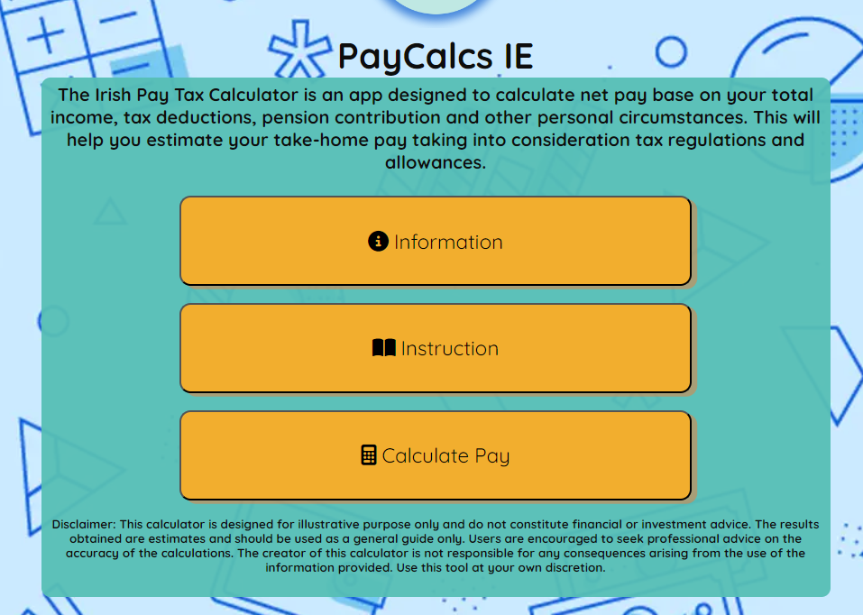

- Compatibility Testing - I've tested this using the following digital device:
    - Iphone 12 Pro
    - Samsung Galaxy A51
    - Macbook pro
     - Windows laptop
- Crossbrowser Testing 
    - Different browsers such as Google Chrome, Edge and Safari were used to test   

## **Bugs and Challenges**
- Ran out of credit in Gitpod so had to install VSCode and set up last minute to continue working on project. Codeanywhere performance is very poor.
- On the Advanced Tab, I am having difficulty 

## **Future Enhancements**

- Convert to a payroll application where data can be stored.
- Multi-Currency Support enable users to input and calculate salaries in different currencies, providing flexibility for international users or businesses operating in multiple countries.

- Additional Income Sources - Incorporate features that allow users to include various income sources beyond the basic salary, such as bonuses, commissions, or freelance earnings.
- Expense Tracking - Integrate an expense tracking module to help users better understand their disposable income after accounting for essential expenses, savings, and discretionary spending.

- Tax Optimization Suggestions - provide recommendations on tax optimization strategies based on the user's financial situation, helping them minimize tax liabilities and maximize take-home pay.

- Graphical Representation of Data - Implement charts or graphs to visually represent the breakdown of income, taxes, and deductions, offering users a more intuitive understanding of their financial data.
Retirement Planning:

- Include tools for estimating retirement savings goals and projections, helping users plan for long-term financial security.

- Mobile App Integration - Develop a mobile application to make the salary calculator more accessible on smartphones, allowing users to perform salary calculations on the go.

- User Accounts and Saving Profiles - Introduce user accounts to save and retrieve salary profiles, enabling users to track changes over time and easily compare different scenarios.

- Machine Learning Predictions - Implement machine learning algorithms to predict future salary growth based on historical data and industry trends, offering users insights into their potential earnings trajectory.

## **Deployment**

The project was deployed to Github pages. Below are the steps used to deploy the site.

1. Once all changes were pushed from VScode. I then go to Github.
2. On Github site's repository, under the Codes tab, lookk for the Deployments section on rigth side of the page.
3. Click + XX deployments under Deployments.
4. Once on teh active deployments page, click the link under github-pages. 
5. Page will open the site.

## **Acknowledgements**

This project will not be live today without the help and support of the following people:

1. Arnold Ambida - my husband, who looks after my 3 children while I do this course.
2. Matt Bodden - my mentor who have made a significant impact on completing this projecs with all the tips and the encouragements.

## **Credits**

 **Website sources**

- https://revenue.ie - on terminology definitions.

- https://shanahan.ie - on terminology definitions.

- https://assets.gov.ie – on terminology definitions.

- https://w3schools.com – code sources for html, css and javascript

- https://stackoverflow.com/ - for codes, background image, tips and answers to some q&a.

- https://irishtaxrebates.ie – on terminology definitions.

- https://flaticon.com - for icons

- https://salaryaftertax.com - to compare calculations.

- [www.tinypng.com](www.tinypng.com) for resizing images.

