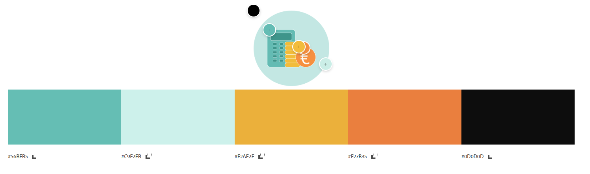
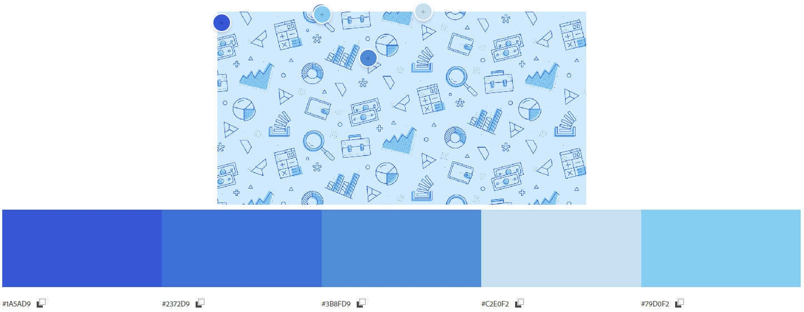

# **Luscious Bliss IE**

# Table of Contents

- [**Project Introduction**](#introduction)
    - **PayCalcs IE**
    - **Link to live project**
- [**Planning Stage**](#planning)
    - **User Goals**
    - **Site Owner Goals**
- [**Design**](#design)
    - **Wireframes**
        - **Desktop Wireframes**
    - **Colour Scheme**
    - **Fonts**
    - **Imagery Used**
- [**Features**](#features)
- [**Technology Used**](#technology)
    - **Language Used**
    - **Frameworks, Libararies & Programs**
- [**Testing**](#testing)
    - **Code Validation**
    - **Contrast Grid**
    - **Testing Performance**
    - **Further Testing**
- [**Future Enhancements**](#enhancements)
- [**Deployment**](#deployment)
- [**Acknowledgements**](#acknowledgement)
- [**Credits**](#credits)

    

## **Project Introduction**
### PayCalcs IE
PayCalcs IE is an app designed to calculate net pay base on your total income, tax deductions, pension contribution and other personal circumstances. This will help you estimate your take-home pay taking into consideration tax regulations and allowances.

### [Link to live project]
### Objectives
## **Planning Stage**
### User Goals
### Site Owner Goals
## **Design**
### Wireframes
- **Desktop Wireframes**
    
### Colour Scheme
I wanted a combination of earthy tones with vibrant pops of colors that creates a versatile and balanced palette. I searched for a logo that would match my project idea. Logo that has a calculator and euro sign. I found this [image](https://cdn-icons-png.flaticon.com/128/9720/9720608.png) on the web for my logo and this [background image](https://cdn.stackoverflow.co/images/jo7n4k8s/production/81cf622ff38560139839d5be23fff951bd33a243-1420x920.png?rect=0,87,1420,746&w=1200&h=630&auto=format&dpr=2) and instantly feel inlove with the colors. So I created a palette for all the colors in the photos.

I also checked the colour combination contrast on 
[Eightshapes Grid Contrast](https://contrast-grid.eightshapes.com/)

### Fonts
I wanted a plain sans serif text that is easy to read both on big and small screens. Also, that looks like a calculator texts. Quicksand is a display sans serif with rounded terminals. According to Google, Quicksand was 'built on a foundation of geometric shapes to give the impression of friendliness. [Google Fonts](https://fonts.google.com/) 

### Imagery Used
Some of the images I used were downloaded from the web (list of websites bon the credits section) and some are my own original photos. They were resized for easy loading of the website. I created the logo to match the color scheme I chose for my website.

## **Features**
- Header - Contains three menu items. Navigation bar should be available on all pages.

- Hero Image & Text - The hero image showcase the top best seller product and the text best describe our products.

- Best Seller section - show the top 3 products that customers always order.

- Testimonials section - these are endorsement from happy and returning customers, who validate the worth of our product.

- Footer section - shows contact information and links to our social media pages

- Products page - gives you all the products we bake.

- Contact Us page provides you a form to complete for you to place the order or ask a questions. You can also see more contact information.

- The aim is to makew the website responsive to mobile devices first and the style for all other devices will be added to make it responsive to all devices.
- Photos will be reduced in size but not in quality for faster loading.
- All sections are responsive to different device size.

## **Technology Used**
- **Language**
    - HTML
    - CSS3
- **Frameworks, Libararies & Programs**
    - Photoshop was used to create the logo and wireframes.
    - [Google Fonts](www.googlefonts.com) to import PT Serif to the stylesheet.
    - [Font Awesome](www.fontawesome) for footer and contact information icons.
    - [GitHub](www.github) for hosting project codes, maintaining repository.
    - [Codeanywhere](www.codeanywhere.com) I initially used this to build my project but find it very slow a lot of times, it takes time for the updates to take effect and longer time to load my workspace.
    - [Gitpod](www.gitpod) I switch to Gitpod and find it easier to use and faster.
    - [Favicon](www.favicon.io) to create favicon for my title.
    - [Am I Responsive](https://amiresponsive.co.uk/) to show the image of the website on different device size.

## **Testing**
- **Code Validation**
    - [W3C Validator](https://validator.w3.org/#validate_by_input) for HTML validation.
        - Home Page
        
        - Products
        
        - Contact Us
        
    - [W3c Validator](https://jigsaw.w3.org/css-validator/) for CSS validation.
        [Results](https://jigsaw.w3.org/css-validator/validator?uri=https%3A%2F%2Fhpcoloma.github.io%2Flusciousbliss-ie&profile=css3svg&usermedium=all&warning=1&vextwarning=&lang=en)
- **Contrast Grid**
    - [Eightshapes Grid Contrast](https://contrast-grid.eightshapes.com/) for checking the colour contrast of my colour palette.
- **Testing Performance**
    - Mobile
        - Home 
        
        - Products
        
        - Contact Us
        
    
    - Desktop
        - Home 
        
        - Products
        
        - Contact Us
        

- **Further Testing**
    - The website was tested on Google Chrome, Safari and Microsoft Edge browsers.
    - The following mobile devices were also used to view the website

## **Future Enhancements**
- The intention is to build an e-commerce website where odering is possible. 
- Make online payment option available.
- Click and collect orders.
- Integrate with delivery channels such as Deliveroo, Uber Eats etc.

## **Deployment**

The project was deployed to Github pages. Below are the steps used to deploy the site.

1. Once all changes were pushed from Gitpod. I then go to Github.
2. On Github site's repository, under the Codes tab, lookk for the Deployments section on rigth side of the page.
3. Click + XX deployments under Deployments.
4. Once on teh active deployments page, click the link under github-pages. 
5. Page will open the site.

## **Acknowledgements**

This project will not be live today without the help and support of the following people:

1. Arnold Ambida - my husband, who looks after my 3 children while I do this course.
2. Matt Boden - my mentor who gave lots of tips and advise during our first meeting.
3. Towbie - for recommending Gitpod. It saved me more time!

## **Credits**

- **Websites source for images**
    - [www.pexels.com](www.pexels.com)
    - [www.pinimg.com](www.pinimg.com)
    - [www.bing.com](www.bing.com)
    - [www.tasteofhome.com](www.tasteofhome.com)
    - [www.carlsbadcravings.com](www.carlsbadcravings.com)
    - [www.shugarysweets.com](www.shugarysweets.com)
- **Image resizing**
    - [www.tinypng.com](www.tinypng.com)

 
 